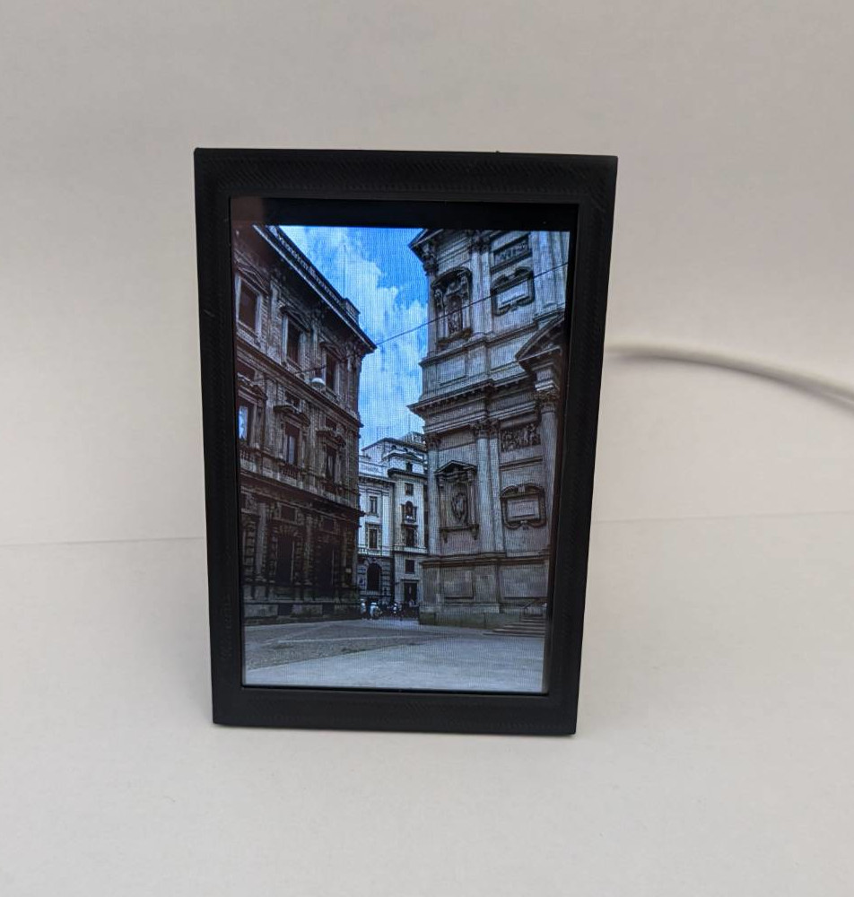

# Arduino Picture Frame

## Features

Main feature is to display images loaded onto sd card.

Device is equipped with touch screen which is used to change settings.

### 1. Changing brightness

Brightness can be changed with four levels, chosen brightness is saved to file with settings, so it will be applied automatically after startup.

### 2. Display time

Chose for how long single image is displayed, it is saved, so it will be applied automatically after startup.

### 3. Display order

3 available display orders:
- **Random** \
Images are displayed in random order, special algorithm is used to ensure that different images will appear.

- **In alphabetical order** \
Images are displayed in order they are visible in folder on sd card.

- **Only current** \
After choosing this option only currently displayed image wil be shown (even after turning off and then turning device on again).

- **Set turn off time** \
Set time after which device will be in sleep mode (screen will be turned off). Touch the screen to awake device.

## Used hardware

**LCD screen** https://www.waveshare.com/4inch-tft-touch-shield.html \
**Arduino Pro Mini 5V** \
**USB C connector** https://botland.store/protoboard-connector-board-accessories/12658-usb-20-typ-c-connector-for-breadboard-pololu-2585-5904422319823.html \
**Power button** https://botland.store/switches-with-button/10799-on-off-bistable-switch-pbw-12a-2a-250v--5904422316648.html

## Make one yourself

Case for device can be 3d printed using project available [here](./recources/case%203D%20print%20files/).

Connection for project:

Additional led can be put into button and connected to arduino GND and VCC (via resistor).

Code can be uploaded to Arduino with PlatformIO extension for VSCodium or Arduino IDE.

#### SD card preparation

1. Upload **.bmp** images from [recourses](./recources/ui%20images/) to sd card
2. Put your images into **/images** folder on sd card

### Image format

Images must be in **24 bit** bmp format (**320px width**, **480px height**) \
In **/images** folder image name must be a number. \
For example 5 images must be named as following: \
0.bmp \
1.bmp \
2.bmp \
3.bmp \
4.bmp

## Author
#### Mateusz Bogusławski (E: mateusz.boguslawski@ibnet.pl)
##### (Case project) Artur Bogusławski (E: artur.boguslawski@ibnet.pl)
